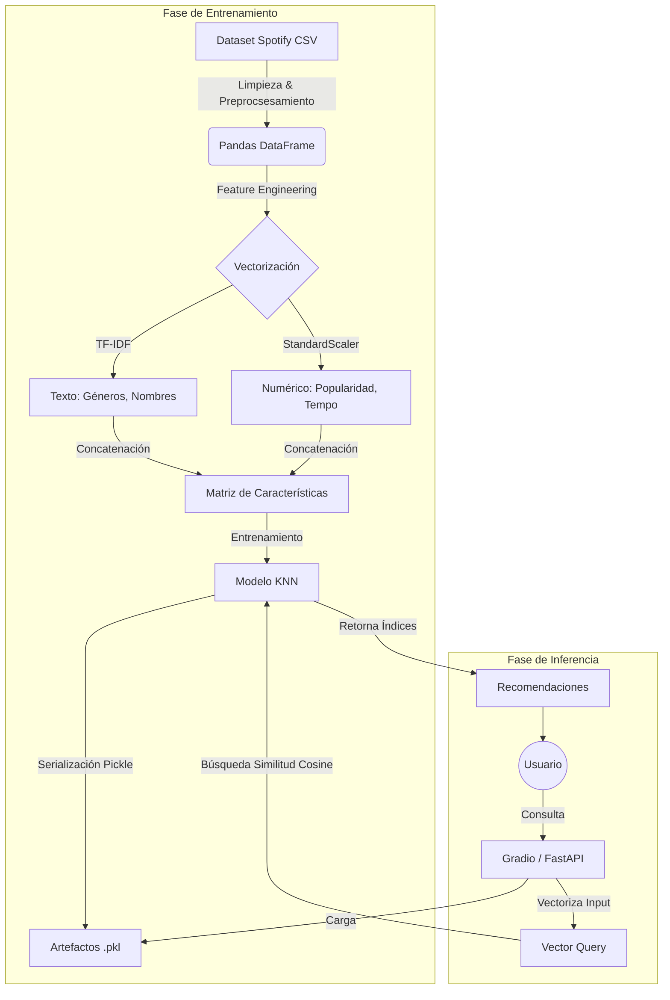

# 📘 Nebula Sound: Análisis Técnico y Documentación

## 🌟 Descripción del Proyecto
**Nebula Sound** es un sistema de recomendación musical *content-based* (basado en contenido) que utiliza inteligencia artificial para sugerir canciones y generar listas de reproducción. A diferencia de los sistemas colaborativos que dependen del historial de millones de usuarios, Nebula Sound analiza los atributos intrínsecos de las pistas (metadatos y características acústicas) para encontrar similitudes matemáticas.

Este proyecto demuestra un pipeline completo de Machine Learning (MLOps incipiente), desde la ingestión y limpieza de datos hasta la exposición del modelo mediante una API REST y una interfaz gráfica interactiva.

---

## 🛠️ Stack Tecnológico y Decisiones de Diseño

El stack fue seleccionado priorizando la **simplicidad, reproducibilidad y rendimiento** para un entorno de demostración y producción ligera.

### 1. Lenguaje: Python 3.9+
*   **Por qué**: Es el estándar de facto en Data Science y ML. Permite unificar el pipeline de entrenamiento (`pandas`, `scikit-learn`) y el backend (`fastapi`) en un solo ecosistema.

### 2. Backend: FastAPI + Uvicorn
*   **Por qué**:
    *   **Velocidad**: FastAPI es uno de los frameworks más rápidos de Python (basado en Starlette y Pydantic).
    *   **Validación automática**: Utiliza *type hints* de Python para validar datos de entrada/salida automáticamente, reduciendo errores en tiempo de ejecución.
    *   **Async/Await**: Soporte nativo para asincronía, crucial si en el futuro se integran llamadas externas (ej. API de Spotify).

### 3. Machine Learning: Scikit-learn
*   **Por qué**:
    *   Provee implementaciones eficientes y maduras de **KNN (K-Nearest Neighbors)** y **TF-IDF**.
    *   Para el volumen de datos actual (~decenas de miles de canciones), una solución en memoria como `NearestNeighbors` es más que suficiente y evita la complejidad de bases de datos vectoriales dedicadas (como Milvus o Pinecone).

### 4. Interfaz: Gradio
*   **Por qué**: Permite prototipar interfaces de usuario para modelos de ML en minutos, directamente desde Python, sin necesidad de escribir HTML/CSS/JS. Ideal para demos técnicas.

### 5. Infraestructura: Docker
*   **Por qué**: Garantiza que el entorno sea idéntico en desarrollo y producción, encapsulando dependencias y resolviendo el problema de "funciona en mi máquina".

---

## 🏗️ Arquitectura del Sistema

El sistema sigue una arquitectura desacoplada dividida en dos fases claras: **Entrenamiento (Offline)** e **Inferencia (Online)**.



### Lógica de los Módulos Principales

#### 1. Preprocesamiento Híbrido (`model/train_model.py`)
El mayor desafío en recomendadores de música es mezclar datos de distinta naturaleza. Nebula Sound aborda esto creando un **espacio vectorial híbrido**:
- **Texto**: Se concatenan `artist_name`, `genres`, `album` y se aplica **TF-IDF**. Esto captura la similitud semántica (e.g., artistas del mismo género o nombres similares).
- **Numérico**: Características como `popularity`, `duration`, `explicit` se normalizan con **StandardScaler**.
- **Fusión**: Ambas matrices se concatenan (`scipy.sparse.hstack`), permitiendo que el modelo considere tanto el "estilo" (texto) como las "estadísticas" (números) de la canción.

#### 2. Motor de Recomendación (`backend/recommender.py`)
- **Carga Lazy**: Los modelos `.pkl` se cargan al iniciar el módulo para mantener las respuestas rápidas (<100ms).
- **Búsqueda Fuzzy**: Se utiliza `RapidFuzz` para corregir errores tipográficos del usuario (e.g., buscar "Weeknd" encuentra "The Weeknd").
- **Inferencia**: Dada una canción de entrada, se transforma usando los *mismos* vectorizadores (`tfidf` y `scaler`) entrenados, garantizando consistencia en el espacio latente.

---

## 📂 Estructura de Archivos Explicada

```bash
Nebula-Sound/
├── .dockerignore       # Optimización de build de imagen
├── Dockerfile          # Definición del contenedor
├── README.md           # Documentación general
├── requirements.txt    # Dependencias pinning
│
├── backend/            # API y Lógica de Negocio
│   ├── main.py         # Entrypoint de FastAPI (Rutas /recommend, /playlist)
│   └── recommender.py  # "Cerebro" del sistema. Maneja la lógica de ML.
│
├── data/               # Capa de Datos
│   └── spotify.csv     # Fuente de verdad (Dataset)
│
├── model/              # Capa de ML (Entrenamiento y Artefactos)
│   ├── train_model.py  # Script ETL: Raw Data -> .pkl Artifacts
│   ├── knn_model.pkl   # Modelo entrenado (estructura de vecinos)
│   ├── scaler.pkl      # Reglas de escalado numérico
│   ├── tfidf.pkl       # Vocabulario y pesos TF-IDF
│   └── cleaned_spotify.csv # CSV optimizado para inferencia
│
└── ui/                 # Capa de Presentación
    └── app.py          # Aplicación Gradio
```

---

## 🚀 Guía de Instalación y Uso

### Prerrequisitos
*   Linux/MacOS/Windows
*   Python 3.9+

### 1. Instalación
```bash
# Clonar repositorio
git clone <repo-url>
cd Nebula-Sound

# Crear entorno virtual
python -m venv venv
source venv/bin/activate  # Linux/Mac
# venv\Scripts\activate   # Windows

# Instalar dependencias
pip install -r requirements.txt
```

### 2. Entrenamiento del Modelo
**Crucial**: Antes de ejecutar la aplicación, debes generar los artefactos del modelo. El sistema no funcionará sin ellos.
```bash
python model/train_model.py
```
*Salida esperada*: Archivos `.pkl` generados en la carpeta `model/`.

### 3. Ejecución
Puedes correr la UI o la API independientemente.

**Opción A: Interfaz Gráfica (Recomendado)**
```bash
python ui/app.py
```
Accede a: `http://localhost:7860`

**Opción B: API Rest**
```bash
uvicorn backend.main:app --reload
```
Swagger UI: `http://localhost:8000/docs`

### 4. Docker (Despliegue)
Para aislar la aplicación en un contenedor:
```bash
docker build -t nebula-sound .
docker run -p 7860:7860 nebula-sound
```

---

## 📡 Referencia de API (Endpoints Clave)

Si utilizas el backend FastAPI, estos son los endpoints principales:

| Método | Endpoint | Parámetros | Descripción |
| :--- | :--- | :--- | :--- |
| `GET` | `/recommend` | `track_name` (str) | Devuelve 5 canciones similares basadas en la semilla. |
| `GET` | `/playlist` | `track_name` (str), `size` (int) | Genera una playlist secuencial a partir de una canción. |
| `GET` | `/artist` | `artist_name` (str) | Busca canciones de un artista usando *fuzzy matching*. |
